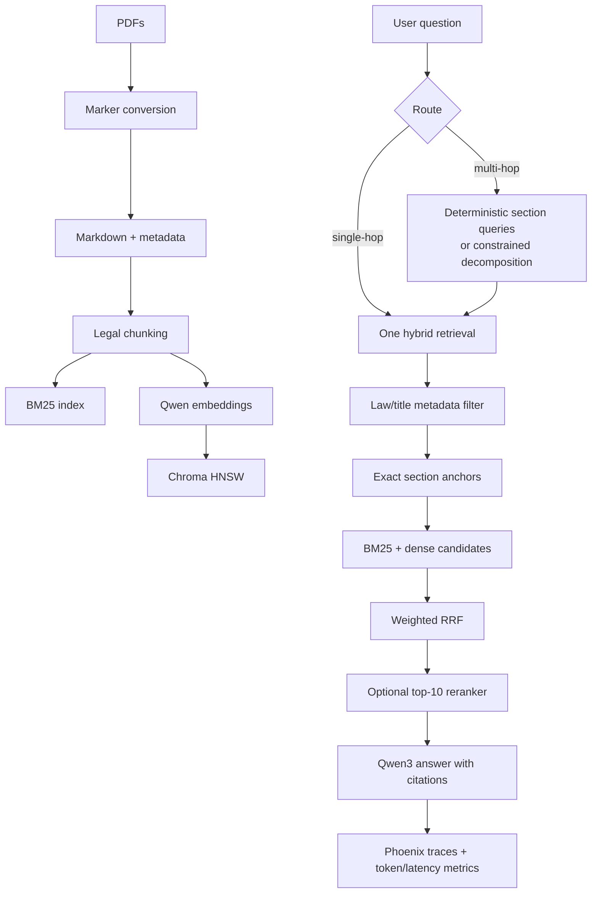

# Local Hybrid RAG

A hardware-aware, local retrieval-augmented generation pipeline for an 8 GB
RTX 5060 laptop. It combines:

- BM25 keyword retrieval
- Qwen3 dense embeddings stored in a persistent local Chroma collection (Chroma's HNSW index)
- Reciprocal Rank Fusion (RRF)
- optional listwise reranking
- adaptive, retrieval-conditioned query decomposition for multi-hop questions
- answer generation with source citations through `qwen3:8b` in Ollama
- RAGAS evaluation for faithfulness and response relevancy
- optional Arize Phoenix tracing for request-level observability

## Architecture

The system keeps exact legal lookup, lexical search, semantic search, and
answer generation as separate stages. When a query names one law, its source
metadata is used as a precision filter; cross-law questions deliberately keep
both document sources available.



For legal questions that mention explicit sections, section-heading chunks are
promoted above generic cross-references. This prevents a reference such as
“see section 146” from outranking the actual Section 146 provision.

## Recommended model profile

| Role | Default | Why |
|---|---|---|
| Generator | `qwen3:8b` | Already installed; use non-thinking mode for normal RAG |
| Embedder | `qwen3-embedding:0.6b` | Strong quality/size trade-off, 1024 dimensions |
| Reranker | `qwen3:8b` listwise prompt, optional | No second GPU model; rerank only a small shortlist |

Do not start with Qwen3-Embedding-4B or Qwen3-Reranker-4B. Keeping those and
the 5.2 GB generator resident would create VRAM pressure and model swapping.

## Query paths

By default, `ask` makes one small, thinking-disabled Qwen3 routing call. The
router chooses `SINGLE_HOP` or `MULTI_HOP`. Use `--normal` or `--multi-hop` to
override it when testing. This router adds latency, so benchmark it against the
manual fast path on your real question set.

Normal query:

```text
query -> BM25 top 30 + Chroma/HNSW top 30 -> RRF top 15
      -> optional rerank top 10 -> Qwen3 answer
```

Multi-hop query:

```text
original retrieval -> top bridge passage
  -> decompose using question + bridge passage
  -> hybrid retrieval for each sub-question
  -> verify/rerank evidence against its own sub-question
  -> merge evidence -> Qwen3 answer
```

The second path follows the key operational lesson from arXiv:2608.00585:
do not reject a later-hop chunk merely because it does not entail the original
question. The fast path remains the default because decomposition is not free.

## Prerequisites

1. Install Python 3.12 (your current Python 3.14 is too new for a dependable
   native vector/ML-adjacent Windows stack).
2. Start Ollama before launching the RAG. The API must be available at
   `http://localhost:11434`:

```powershell
ollama serve
ollama list
```

If the Ollama desktop app is already running, `ollama serve` may report that
the port is in use; that is expected. Confirm the API responds before asking a
question:

```powershell
Invoke-WebRequest http://localhost:11434/api/tags
```

The UI now reports this startup instruction instead of exposing an opaque
connection-refused traceback when Ollama is stopped.

3. Create the environment and install the project with Marker support:

```powershell
py -3.12 -m venv .venv
.venv\Scripts\Activate.ps1
python -m pip install -U pip
pip install -e ".[marker]"
```

4. Pull the embedding model:

```powershell
ollama pull qwen3-embedding:0.6b
```

## Use

Put PDFs under `data/documents`. Convert them to Markdown with Marker first:

```powershell
hybrid-rag convert data/documents --output data/markdown
```

The default fast mode uses the PDF text layer and avoids OCR/VLM calls. For
scanned or garbled pages, enable OCR:

```powershell
hybrid-rag convert data/documents --output data/markdown --ocr
```

Then ingest the generated Markdown:

```powershell
hybrid-rag ingest data/markdown
hybrid-rag ingest data/documents
hybrid-rag-ui
hybrid-rag ask "What does the collection say about ...?"
hybrid-rag ask --normal "Force the fast single-hop path"
hybrid-rag ask --multi-hop "Which ... and how does it relate to ...?"
 hybrid-rag ask --rerank "Find the exact policy for ABC-123"
```

## Evaluate quality with RAGAS

Install the optional local evaluation dependencies:

```powershell
pip install -e ".[eval]"
```

Create a JSONL file with one question per line. Add a gold `reference` answer
for ROUGE and token-overlap scores. Add `reference_sources` containing the
relevant chunk labels for retrieval precision, recall, F1, hit-rate, MRR, and
NDCG:

```json
{"question":"What punishment is provided for qatl-i-amd under section 302?","reference":"The punishment is death as qisas, death or life imprisonment as tazir, or imprisonment up to 25 years where qisas does not apply.","reference_sources":["pakistan_law\\pakistan_law.md#173"]}
```

Run the evaluation. The same local `qwen3:8b` judges the answer, and the local
embedding model is used for response relevancy:

```powershell
hybrid-rag eval data/eval/questions.jsonl --output outputs/ragas.json
```

For a quick pass that calculates only retrieval and reference-answer metrics
without slow LLM judging, add `--skip-ragas`.

The output contains a summary and per-example scores. RAGAS provides
`faithfulness` and `response_relevancy`; deterministic evaluation adds
retrieval precision/recall/F1, hit-rate, MRR, NDCG, ROUGE-1/2/L, answer token
precision/recall/F1, and exact match when their required gold fields exist.
The scores are also attached to the corresponding Phoenix trace as annotations
when `PHOENIX_ENABLED=true`. Expect RAGAS to be slower than normal RAG because
its metrics use additional local judge calls.

## Trace requests in Arize Phoenix

Install the lightweight Phoenix tracing client in the RAG environment:

```powershell
pip install -e ".[phoenix]"
```

Run the Phoenix server in a separate environment. This avoids dependency
conflicts between Phoenix's web UI, Gradio, Marker, and the evaluation stack:

```powershell
py -3.12 -m venv .phoenix-venv
.phoenix-venv\Scripts\python.exe -m pip install -U arize-phoenix
$env:PYTHONUTF8="1"
$env:PYTHONIOENCODING="utf-8"
$env:PHOENIX_WORKING_DIR="$PWD\.phoenix_v20"
.phoenix-venv\Scripts\phoenix.exe serve
```

The UTF-8 settings are required on some Windows installations while Phoenix
creates or migrates its local database. Keep this terminal running. If an old
Phoenix process is already using port 6006, stop that process before starting
the new server.

Then enable tracing before starting the RAG UI:

```powershell
$env:PHOENIX_ENABLED="true"
$env:PHOENIX_PROJECT_NAME="Local Hybrid RAG"
hybrid-rag-ui
```

Open the Phoenix URL printed by `phoenix serve` (usually
`http://127.0.0.1:6006`). Each request is recorded with its question and
whether reranking was enabled. For Phoenix Cloud, additionally set
`PHOENIX_API_KEY`, `PHOENIX_COLLECTOR_ENDPOINT`, and the OpenTelemetry headers
described in the [Haystack Phoenix evaluation guide](https://haystack.deepset.ai/cookbook/arize_phoenix_evaluate_haystack_rag).

Without a route flag, the LLM router chooses the path. Use `--multi-hop` only
when you want to force decomposition, or `--normal` to skip the router.
Use `--rerank` for harder queries; it adds one local LLM call. Both can be used
together, where the one listwise call scores chunks against their assigned
sub-question rather than the original question.

The UI opens at `http://127.0.0.1:7860` and shows the chosen route and retrieved
source chunks alongside the answer. Run `hybrid-rag-ui --port 7861` to use a
different port.

Configuration is via environment variables; see `.env.example`.

## Initial tuning targets

- Chunk size: 350 words, 60-word overlap
- Candidate pools: 30 BM25 + 30 dense
- RRF: `k=60`, fused top 15
- Default fusion weights: 40% BM25, 60% semantic (tunable with
  `BM25_WEIGHT` and `SEMANTIC_WEIGHT`)
- Rerank: top 10 down to 6
- Chroma: persistent local collection under `.chroma/`
- Generation context: at most 6 chunks
- Claim verification: optional (`VERIFY_ANSWERS=true`); strict blocking is
  controlled separately with `ENFORCE_GROUNDING=true`
- Document-title filtering: automatic for a single explicitly named law;
  `DOCUMENT_CONSTRAINTS=true` can additionally force filtering for ambiguous
  queries. The catalog is built from indexed source metadata, so it covers all
  documents without a hand-maintained alias list.
- Ollama generation context: 8192 tokens by default (`OLLAMA_NUM_CTX=8192`) to
  fit an 8 GB GPU

These are starting values, not universal truths. Build a small evaluation set
of roughly 50 real questions and tune recall@k, answer correctness, groundedness,
and p50/p95 latency before changing models.

## Compare hybrid weights and reranking

The reproducible six-way ablation keeps BM25 and Chroma dense candidate pools at 30,
uses weighted RRF, reranks the fused candidates when requested, and evaluates
the final four chunks. It compares 50/50, 60/40 BM25/semantic, and 40/60
BM25/semantic, each with and without the Qwen ranker:

```powershell
$env:PYTHONUTF8="1"
.venv\Scripts\python.exe scripts\run_retrieval_ablation.py `
  data\eval\questions.jsonl `
  --output-dir outputs\ablation `
  --skip-ragas
```

The aggregate table is written to `outputs/ablation/comparison.json`, with one
full report per configuration. `--skip-ragas` keeps this sweep fast and
deterministic; run the full RAGAS evaluation only for the selected winner.
